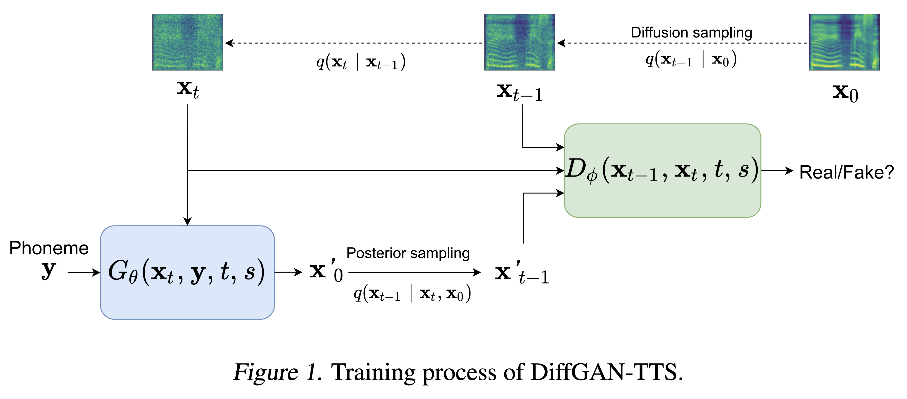
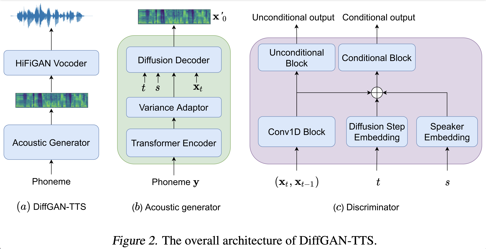
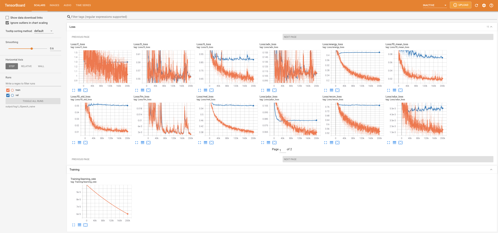
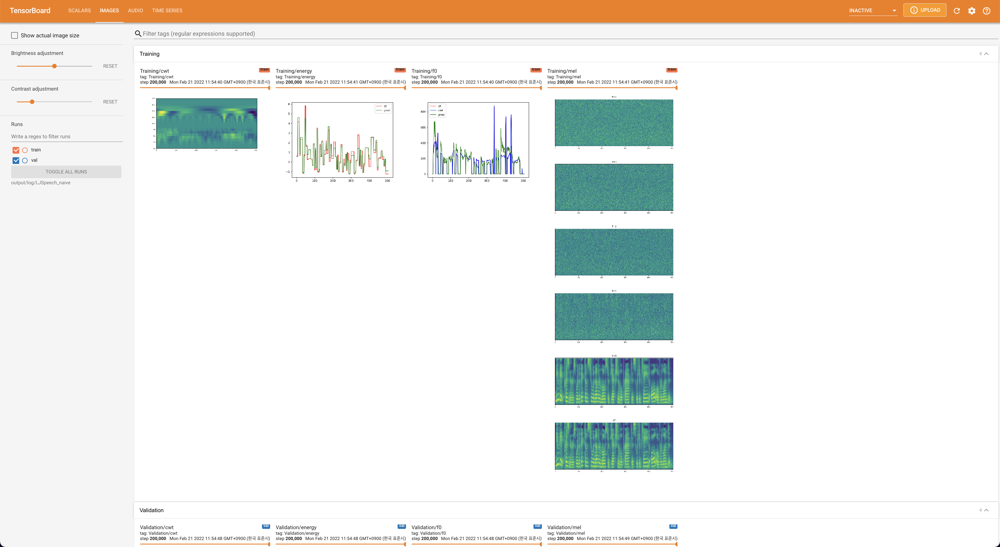
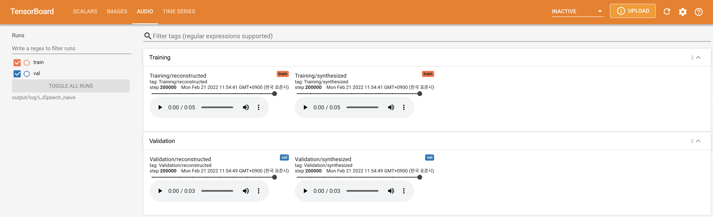
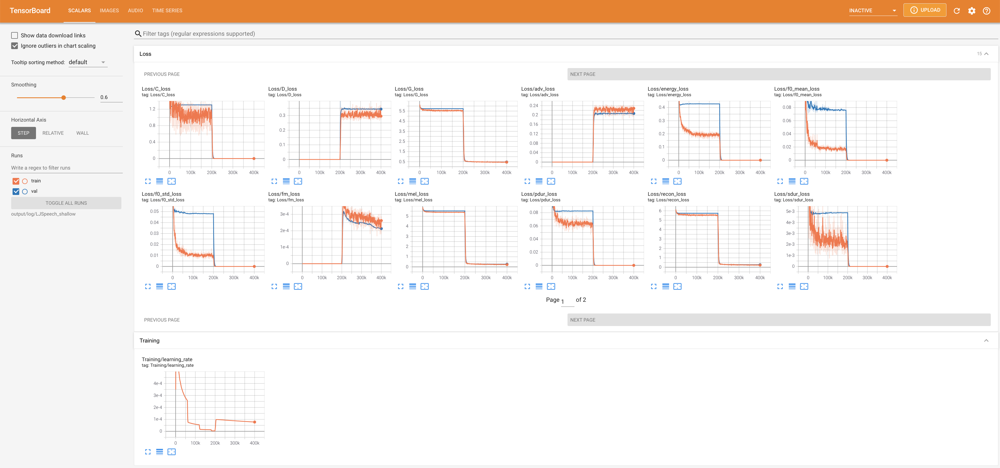
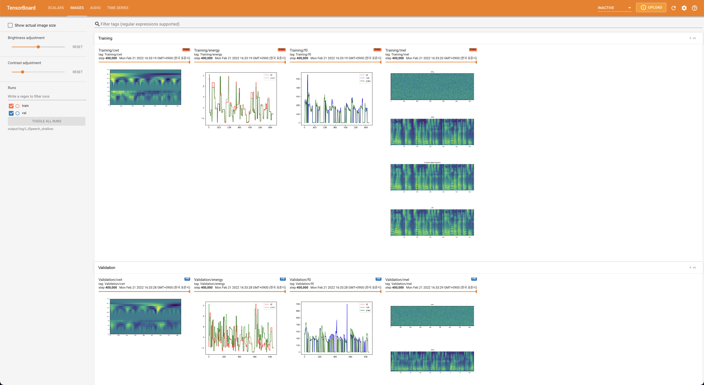

# DiffGAN-TTS - PyTorch Implementation

PyTorch implementation of [DiffGAN-TTS: High-Fidelity and Efficient Text-to-Speech with Denoising Diffusion GANs](https://arxiv.org/abs/2201.11972)

<p align="center">
    
</p>

<p align="center">
    
</p>

# Repository Status
- [x] Naive Version of DiffGAN-TTS
- [x] Active Shallow Diffusion Mechanism: DiffGAN-TTS (two-stage)

## Audio Samples
Audio samples are available at [/demo](https://github.com/keonlee9420/DiffGAN-TTS/tree/main/demo).

# Quickstart

***DATASET*** refers to the names of datasets such as `LJSpeech` and `VCTK` in the following documents.

***MODEL*** refers to the types of model (choose from '**naive**', '**aux**', '**shallow**').

## Dependencies
You can install the Python dependencies with
```
pip3 install -r requirements.txt
```

## Inference

You have to download the [pretrained models](https://drive.google.com/drive/folders/14EqKdfq3hTCg8BQ1ZTc8aJwwnpkFOAzh?usp=sharing) and put them in 
- ``output/ckpt/DATASET_naive/`` for '**naive**' model.
- ``output/ckpt/DATASET_shallow/`` for '**shallow**' model. Please note that the checkpoint of the '**shallow**' model contains both '**shallow**' and '**aux**' models, and these two models will share all directories except results throughout the whole process.

For a **single-speaker TTS**, run
```
python3 synthesize.py --text "YOUR_DESIRED_TEXT" --model MODEL --restore_step RESTORE_STEP --mode single --dataset DATASET
```

For a **multi-speaker TTS**, run
```
python3 synthesize.py --text "YOUR_DESIRED_TEXT" --model MODEL --speaker_id SPEAKER_ID --restore_step RESTORE_STEP --mode single --dataset DATASET
```

The dictionary of learned speakers can be found at `preprocessed_data/DATASET/speakers.json`, and the generated utterances will be put in `output/result/`.

## Batch Inference
Batch inference is also supported, try

```
python3 synthesize.py --source preprocessed_data/DATASET/val.txt --model MODEL --restore_step RESTORE_STEP --mode batch --dataset DATASET
```
to synthesize all utterances in ``preprocessed_data/DATASET/val.txt``.


## Controllability
The pitch/volume/speaking rate of the synthesized utterances can be controlled by specifying the desired pitch/energy/duration ratios.
For example, one can increase the speaking rate by 20 % and decrease the volume by 20 % by

```
python3 synthesize.py --text "YOUR_DESIRED_TEXT" --model MODEL --restore_step RESTORE_STEP --mode single --dataset DATASET --duration_control 0.8 --energy_control 0.8
```

Please note that the controllability is originated from [FastSpeech2](https://arxiv.org/abs/2006.04558) and not a vital interest of DiffGAN-TTS.

# Training

## Datasets

The supported datasets are

- [LJSpeech](https://keithito.com/LJ-Speech-Dataset/): a **single-speaker** English dataset consists of 13100 short audio clips of a female speaker reading passages from 7 non-fiction books, approximately 24 hours in total.

- [VCTK](https://datashare.ed.ac.uk/handle/10283/3443): The CSTR VCTK Corpus includes speech data uttered by 110 English speakers (**multi-speaker TTS**) with various accents. Each speaker reads out about 400 sentences, which were selected from a newspaper, the rainbow passage and an elicitation paragraph used for the speech accent archive.

## Preprocessing

- For a **multi-speaker TTS** with external speaker embedder, download [ResCNN Softmax+Triplet pretrained model](https://drive.google.com/file/d/1F9NvdrarWZNktdX9KlRYWWHDwRkip_aP) of [philipperemy's DeepSpeaker](https://github.com/philipperemy/deep-speaker) for the speaker embedding and locate it in `./deepspeaker/pretrained_models/`.
- Run
    ```
    python3 prepare_align.py --dataset DATASET
    ```
    for some preparations.

    For the forced alignment, [Montreal Forced Aligner](https://montreal-forced-aligner.readthedocs.io/en/latest/) (MFA) is used to obtain the alignments between the utterances and the phoneme sequences.
    Pre-extracted alignments for the datasets are provided [here](https://drive.google.com/drive/folders/1fizpyOiQ1lG2UDaMlXnT3Ll4_j6Xwg7K?usp=sharing). 
    You have to unzip the files in `preprocessed_data/DATASET/TextGrid/`. Alternately, you can [run the aligner by yourself](https://montreal-forced-aligner.readthedocs.io/en/latest/user_guide/workflows/index.html).

    After that, run the preprocessing script by
    ```
    python3 preprocess.py --dataset DATASET
    ```

## Training

You can train three types of model: '**naive**', '**aux**', and '**shallow**'.

- Training Naive Version ('**naive**'):

    Train the naive version with
    ```
    python3 train.py --model naive --dataset DATASET
    ```

- Training Basic Acoustic Model for Shallow Version ('**aux**'):

    To train the shallow version, we need a pre-trained FastSpeech2. The below command will let you train the FastSpeech2 modules, including Auxiliary (Mel) Decoder.
    ```
    python3 train.py --model aux --dataset DATASET
    ```

- Training Shallow Version ('**shallow**'):

    To leverage pre-trained FastSpeech2, including Auxiliary (Mel) Decoder, you must pass `--restore_step` with the final step of auxiliary FastSpeech2 training as the following command.
    ```
    python3 train.py --model shallow --restore_step RESTORE_STEP --dataset DATASET
    ```
    For example, if the last checkpoint is saved at 200000 steps during the auxiliary training, you have to set `--restore_step` with `200000`. Then it will load and freeze the aux model and then continue the training under the active shallow diffusion mechanism.

# TensorBoard

Use
```
tensorboard --logdir output/log/DATASET
```

to serve TensorBoard on your localhost.
The loss curves, synthesized mel-spectrograms, and audios are shown.

## Naive Diffusion





## Shallow Diffusion





# Notes

- In addition to the Diffusion Decoder, the Variance Adaptor is also conditioned on speaker information.
- Unconditional and Conditional output of the JCU discriminator is averaged during each of loss calculation as [VocGAN](https://www.isca-speech.org/archive/pdfs/interspeech_2020/yang20_interspeech.pdf) did.
- Some differences on the Data and Preprocessing compared to the original paper:
    - Using VCTK (109 speakers) instead of Mandarin Chinese of 228 speakers.
    - Following [DiffSpeech](https://github.com/keonlee9420/DiffSinger)'s audio config, e.g., sample rate is 22050Hz rather than 24,000Hz.
    - Also, following [DiffSpeech](https://github.com/keonlee9420/DiffSinger)'s variance extraction and modeling.
- `lambda_fm` is fixed to a scala value since the dynamically scaled scalar computed as L_recon/L_fm makes the model explode.
- Two options for embedding for the **multi-speaker TTS** setting: training speaker embedder from scratch or using a pre-trained [philipperemy's DeepSpeaker](https://github.com/philipperemy/deep-speaker) model (as [STYLER](https://github.com/keonlee9420/STYLER) did). You can toggle it by setting the config (between `'none'` and `'DeepSpeaker'`).
- DeepSpeaker on VCTK dataset shows clear identification among speakers. The following figure shows the T-SNE plot of extracted speaker embedding.

<p align="center">
    
</p>

# Citation

Please cite this repository by the "[Cite this repository](https://github.blog/2021-08-19-enhanced-support-citations-github/)" of **About** section (top right of the main page).

# References
- [keonlee9420's DiffSinger](https://github.com/keonlee9420/DiffSinger)
- [keonlee9420's Comprehensive-Transformer-TTS](https://github.com/keonlee9420/Comprehensive-Transformer-TTS)
- [LynnHo' DCGAN-LSGAN-WGAN-GP-DRAGAN-Pytorch](https://github.com/LynnHo/DCGAN-LSGAN-WGAN-GP-DRAGAN-Pytorch)
- [seungwonpark' melgan](https://github.com/seungwonpark/melgan)
- [Denoising Diffusion Probabilistic Models](https://arxiv.org/abs/2006.11239)
- [Tackling the Generative Learning Trilemma with Denoising Diffusion GANs](https://arxiv.org/abs/2112.07804)
- [DiffSinger: Singing Voice Synthesis via Shallow Diffusion Mechanism](https://arxiv.org/abs/2105.02446)
